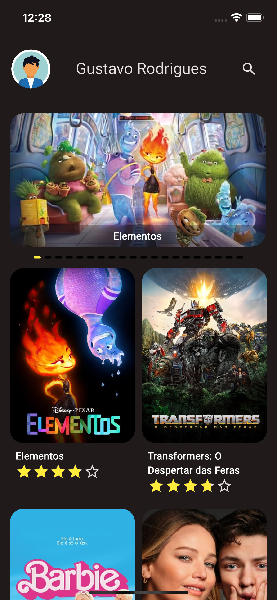
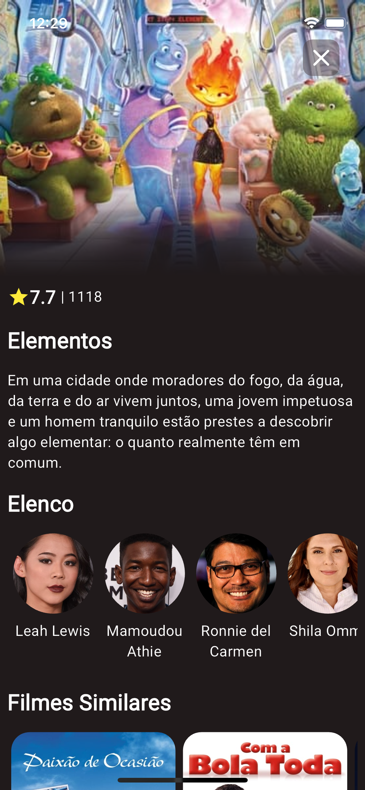
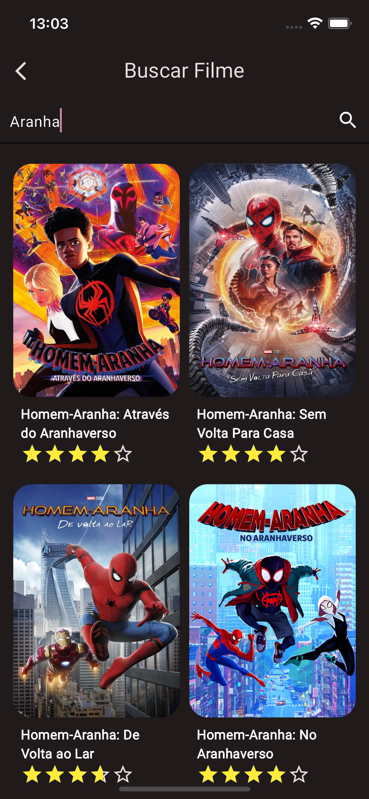

# movies
<div>
    <table>
        <th>
            
            
            
        </th>
    </table>
</div>

Projeto esta em constante desenvolvimento para estudo.

## Projeto construido com:

- **Clean Dart** que se baseia em **Clean Architecture** [[doc]](https://github.com/Flutterando/Clean-Dart/blob/cce751ea0a22a796c3559ba458f50d9a0552c4ef/README_en.md)

- **ValueNotifier** Nativo do Flutter para gerencia de estado [[pub.dev]](https://pub.dev/packages/flutter_triple) [[doc]](https://api.flutter.dev/flutter/foundation/ValueNotifier-class.html?gclid=Cj0KCQjw84anBhCtARIsAISI-xeyvty-D85uPQn8HhyGOe618g6UfSjuazQu5qc8iD0LGhaappAuS8EaAr8sEALw_wcB&gclsrc=aw.ds)
- **get_it** Para injeção de dependencia [[pub.dev]](https://pub.dev/packages/get_it)


## Para rodar o projeto:
```
flutter pub get
flutter run
```


## Getting Started

This project is a starting point for a Flutter application.

A few resources to get you started if this is your first Flutter project:

- [Lab: Write your first Flutter app](https://docs.flutter.dev/get-started/codelab)
- [Cookbook: Useful Flutter samples](https://docs.flutter.dev/cookbook)

For help getting started with Flutter development, view the
[online documentation](https://docs.flutter.dev/), which offers tutorials,
samples, guidance on mobile development, and a full API reference.
